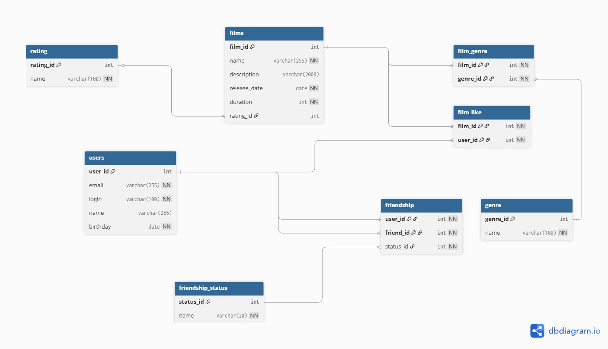

# Filmorate

Приложение для поиска и оценки фильмов. Пользователи могут ставить лайки фильмам, добавлять друзей.

## Схема базы данных

## Описание таблиц

- **rating** — Возрастные рейтинги (G, PG, PG-13, R, NC-17)
- **genre** — Жанры фильмом (комедия, драма, мультфильм, триллер, документальный, боевик)
- **friendship_status** — Статусы дружбы (PENDING, CONFIRMED)
- **films** — Фильмы приложения
- **users** — Пользователи приложения
- **film_genre** — Связь фильмов с жанрами
- **film_like** — Лайки пользователей к фильмам
- **friendship** — Дружеские связи между пользователями

